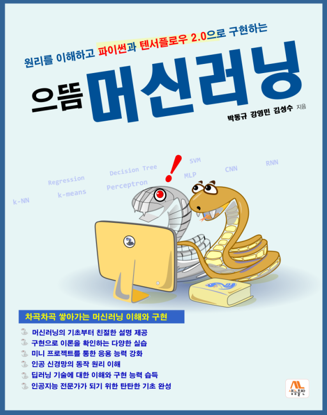

# "으뜸 머신러닝" 저장소 소개
## 프로그램 코드와 자료를 제공합니다.

안녕하세요 독자여러분 이곳은 생능출판사의 책 "으뜸 머신러닝"(2021년 7월 출간예정) 관련 저장소입니다. 이 책의 소스코드와 주피터 노트북 파일, colab 주소, 정오표등 다양한 자료와 정보를 업로드할 예정입니다.

"으뜸 머신러닝"은 머신러닝을 처음 배우는 입문자와 머신 러닝의 개념을 익힌 상태에서 텐서플로우를 이용한 개발과 코딩에 도전하는 개발자를 위한 책입니다.

  

# 책의 목차
* [[목차]] 으뜸 머신러닝 책의 목차를 제공합니다.

